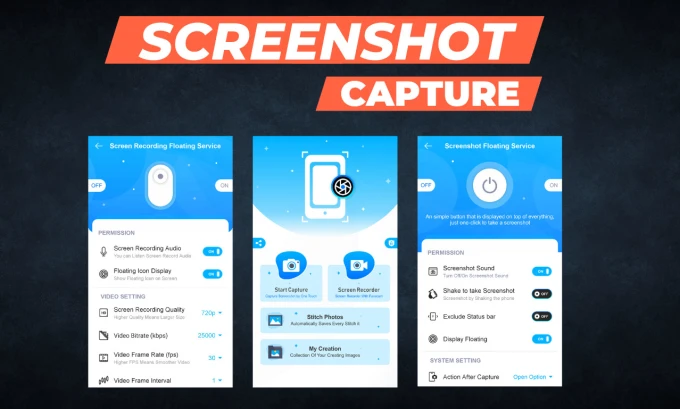

# QuickScreenshotCapture

Quick Screenshot Capture is the most simple, smallest and fastest screenshot taking app.

## Screenshot

## Some feature listed over here:
<ul>
<li> Easy and user-friendly interface </li>
<li> One-touch Floating button </li>
<li> Time interval to capture screen </li>
<li> Notification icon click </li>
<li> Capture screenshot by one touch </li>
<li> Crop screenshot to the desired size </li>
</ul>

## Social Media

